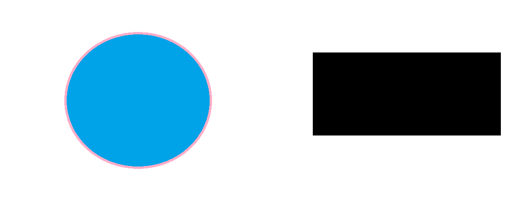
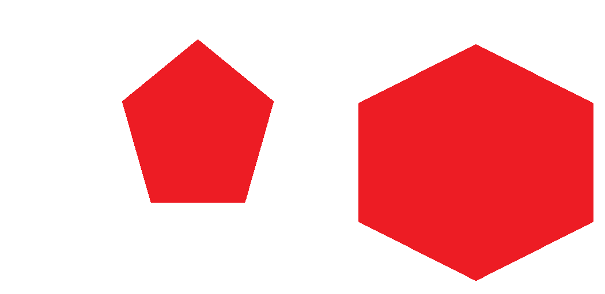
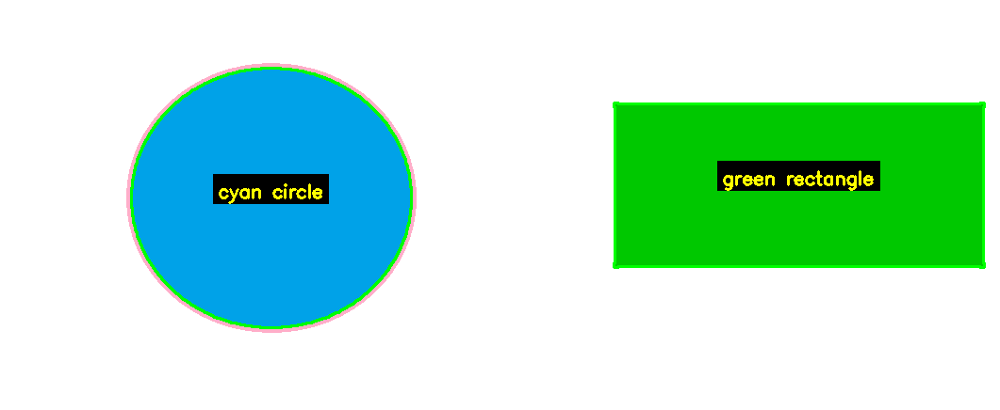

# ShapeDetection

An interactive Python command-line application that uses computer vision to **detect geometric shapes and their colors** in an image, describe them in natural language, and **recolor any detected shape on demand**.

Built with **OpenCV** and **NumPy**.

## Features

- **Shape detection** – recognizes circles, triangles, squares, rectangles, pentagons and hexagons
- **Color recognition** – identifies the color of each shape
- **Natural-language description** – summarizes the result, e.g. *"Am detectat: un cerc rosu, un patrat galben și un hexagon violet."* (the interface is in Romanian)
- **Visual output** – displays the image with every detected shape labeled
- **Interactive recoloring** – pick a detected shape and change its color to one of 11 colors (red, green, blue, yellow, orange, purple, pink, cyan, white, black, gray); the image is re-analyzed after each change
- **Automatic saving** – the recolored result is saved as `rezultat.png`
- **Three input modes**
  1. Generate a built-in test image containing six different shapes
  2. Load your own image from disk
  3. Generate a single shape of your choice and color

## Demo

| Input 1 | Input 2 | Result |
|---|---|---|
|  |  |  |

## Project Structure

```
ShapeDetection/
├── main.py               # Interactive CLI: menu, image generation, user interaction, output
├── shape_detector.py     # Core logic: detect_shapes, draw_shapes, change_shape_color
├── p1.png                # Sample input image
├── p2.png                # Sample input image
├── rezultat.png          # Example output (saved by the program)
└── README.md
```

## Getting Started

### Requirements

- Python 3.8+
- OpenCV and NumPy

```bash
pip install opencv-python numpy
```

### Installation

```bash
git clone https://github.com/schintee/ShapeDetection.git
cd ShapeDetection
```

### Run

```bash
python main.py
```

You will see a menu:

```
1. Generează imagine de test      (generate test image)
2. Încarcă o imagine proprie      (load your own image)
3. Generează o formă singură      (generate a single shape)
0. Ieși                           (exit)
```

## Usage Example

1. Choose **1** to generate the test image.
2. The program prints what it found and opens a window with the labeled shapes. Press any key in the image window to continue.
3. Answer `da` (yes) when asked whether to change a shape's color, choose the shape by its number, then pick a new color.
4. The updated image is displayed and saved as `rezultat.png`. You can keep recoloring other shapes or answer `nu` to stop.

To use your own picture, choose **2** and enter the path, e.g. `C:/poze/test.jpg`. Best results are obtained with clearly separated, solid-colored shapes on a plain background.

## Tech Stack

- Python 3
- OpenCV (`cv2`) – image processing, drawing, display
- NumPy – image arrays and geometry

## Possible Improvements

- Real-time detection from a webcam
- English/Romanian language switch
- Command-line arguments and a simple GUI
- Support for more shapes (ellipse, star, polygon with more sides) and textured backgrounds
- Unit tests for the detector


## License

*[Add a license, e.g. MIT]*
